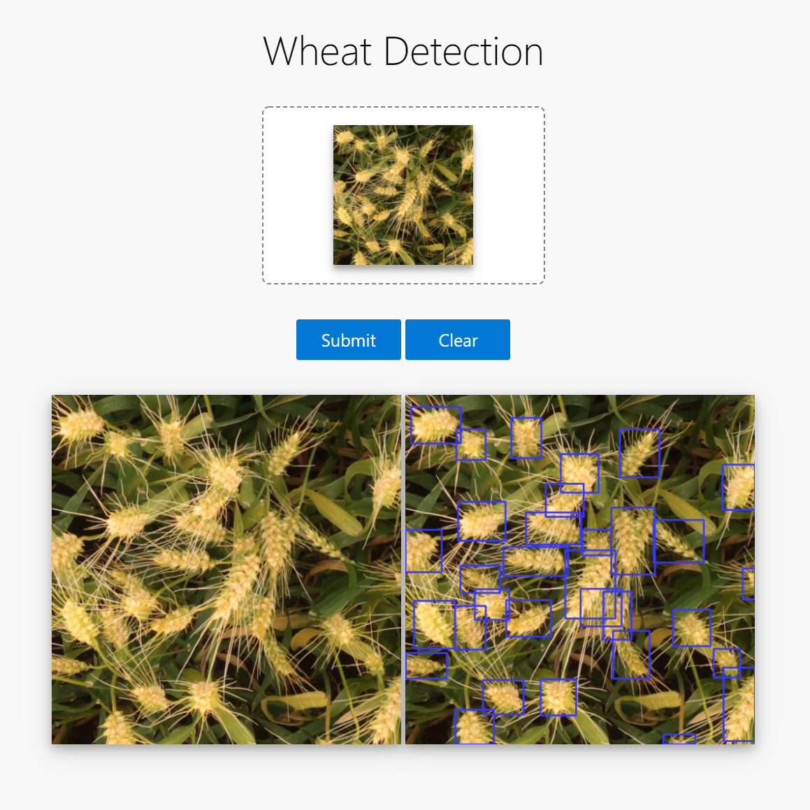
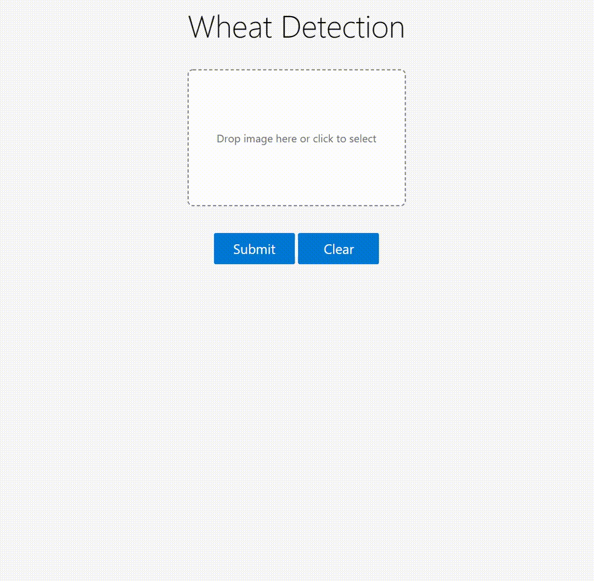

# Deploy Model with Flask as Web App in 10 Minutes

A pretty and customizable web app to deploy your DL model with ease following [this work](https://github.com/imfing/keras-flask-deploy-webapp). 

(support detection and segmentation models)

## Getting Started in 10 Minutes

- Clone this repo 
- Install requirements
- Run the script
- Go to http://localhost:5000
- Done! :tada:

:point_down: Screenshot:

<p align="center">
  
</p>

## New Features :fire:

- Enhanced, mobile-friendly UI
- Support image drag-and-drop
- Use vanilla JavaScript, HTML and CSS. Remove jQuery and Bootstrap
- Switch to TensorFlow 2.0 and [tf.keras](https://www.tensorflow.org/guide/keras) by default

------------------

## Run with Docker

With **[Docker](https://www.docker.com)**, you can quickly build and run the entire application in minutes :whale:

```shell
# 1. First, clone the repo
$ git clone git@github.com:Chuxwa/a-simple-flask-deploy-webapp.git
$ cd keras-flask-deploy-webapp
$ git submodule update --init --recursive

# 2. Build Docker image
$ docker build -t keras_flask_app .

# 3. Run!
$ docker run -it --rm -p 5000:5000 keras_flask_app
```

Open http://localhost:5000 and wait till the webpage is loaded.

## Local Installation

It's easy to install and run it on your computer.

```shell
# 1. First, clone the repo
$ git clone git@github.com:Chuxwa/a-simple-flask-deploy-webapp.git
$ cd keras-flask-deploy-webapp
$ git submodule update --init --recursive

# 2. Install Python packages
$ pip install -r requirements.txt

# 3. Run!
$ python app.py
```

Open http://localhost:5000 and have fun. :smiley:

<p align="center">
  
</p>


------------------

## Customization

It's also easy to customize and include your models in this app.

<details>
 <summary>Details</summary>

### Use your own model

Place your trained `.h5` file saved by `model.save()` under models directory.

Check the [commented code](https://github.com/Chuxwa/a-simple-flask-deploy-webapp/blob/master/app.py#L37) in app.py.

### Use other pre-trained model

See [Keras applications](https://keras.io/applications/) for more available models such as DenseNet, MobilNet, NASNet, etc.

Check [this section](https://github.com/Chuxwa/a-simple-flask-deploy-webapp/blob/master/app.py#L35) in app.py.

### UI Modification

Modify files in `templates` and `static` directory.

`index.html` for the UI and `main.js` for all the behaviors.

</details>


## Deployment

To deploy it for public use, you need to have a public **linux server**.

<details>
 <summary>Details</summary>
  
### Run the app

Run the script and hide it in background with `tmux` or `screen`.
```
$ python app.py
```

You can also use gunicorn instead of gevent
```
$ gunicorn -b 127.0.0.1:5000 app:app
```

More deployment options, check [here](https://flask.palletsprojects.com/en/1.1.x/deploying/wsgi-standalone/)

### Set up Nginx

To redirect the traffic to your local app.
Configure your Nginx `.conf` file.

```
server {
  listen  80;

  client_max_body_size 20M;

  location / {
      proxy_pass http://127.0.0.1:5000;
  }
}
```

</details>
